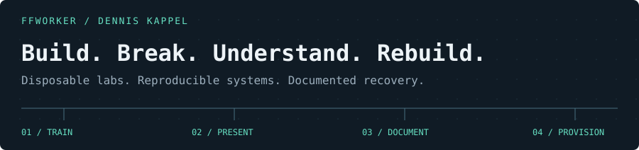
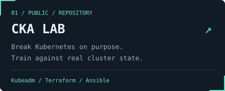
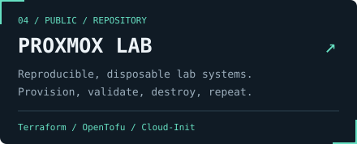
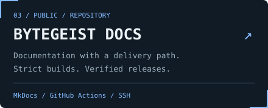
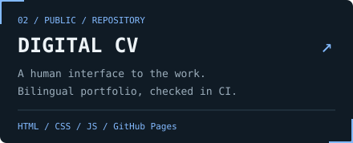
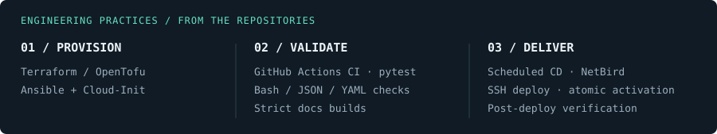

I build and operate infrastructure I can understand when it breaks.

Linux, networking, virtualization, containers and Kubernetes are where I spend most of my time. This profile is the technical side of my portfolio: public labs, automation, validation workflows, recovery-oriented documentation and the things I am actively learning.

**[Detailed self-assessed skills →](https://cv.bytegeist.dev/skills.html)**  
What I can do manually, where I still use documentation or AI heavily, and what I would or would not trust myself to change directly in production.

  
  
  
  

### Public proof of work

- **[CKA Lab](https://github.com/ffworker/cka-lab)** — Kubernetes break/fix training against real cluster state, disposable Proxmox infrastructure and live validation.
- **[Proxmox Lab](https://github.com/ffworker/proxmox-lab)** — repeatable disposable infrastructure with Terraform/OpenTofu, Ansible and Cloud-Init, with explicit lifecycle and recovery boundaries.
- **[Bytegeist Docs](https://github.com/ffworker/bytegeist-docs)** — documentation ownership, validation and controlled delivery across public/private boundaries.
- **[Digital CV](https://github.com/ffworker/my-digital-cv)** — this portfolio itself: bilingual static site, validation and reviewed deployment through GitHub Actions.

Implementation examples: <a href="https://github.com/ffworker/cka-lab/blob/main/.github/workflows/learning-validate.yml">CKA validation</a> · <a href="https://github.com/ffworker/proxmox-lab/blob/main/.github/workflows/rocky-kubernetes-proxmox-validate.yml">Proxmox/IaC validation</a> · <a href="https://github.com/ffworker/bytegeist-docs/blob/main/.github/workflows/ci.yml">documentation CI</a> · <a href="https://github.com/ffworker/bytegeist-docs/blob/main/.github/workflows/nightly.yml">scheduled delivery</a>.

[Human-readable CV ↗](https://cv.bytegeist.dev) · [Detailed skills ↗](https://cv.bytegeist.dev/skills.html) · [Explore repositories ↗](https://github.com/ffworker?tab=repositories)
